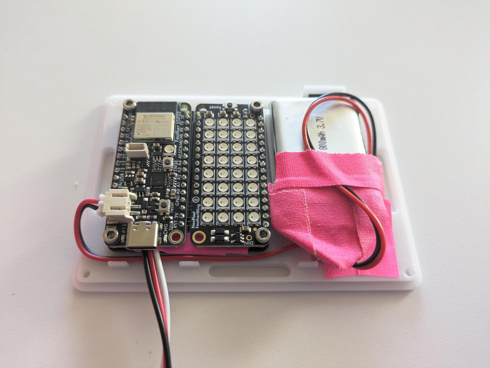
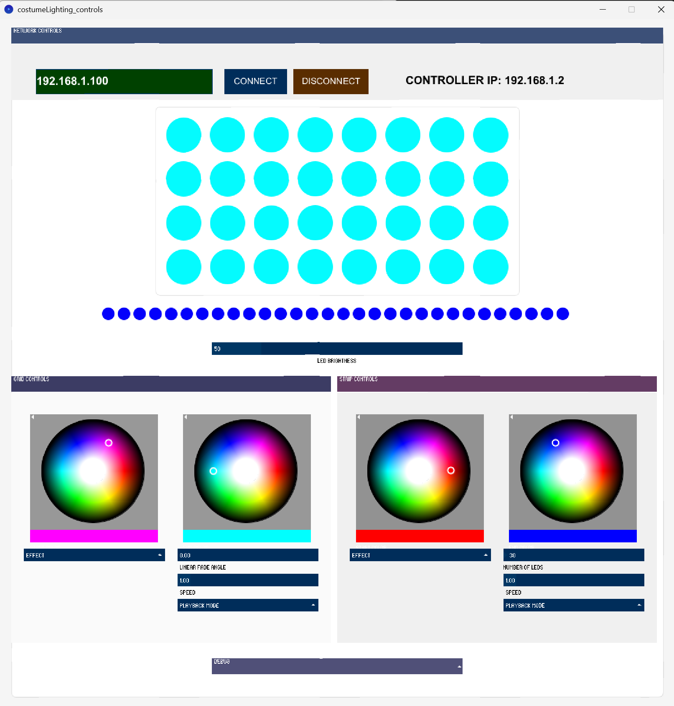
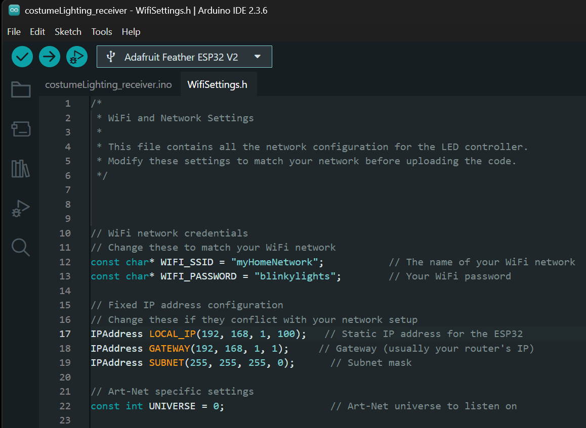
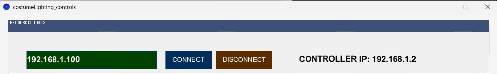

# Costume Lighting Controls



## Table of Contents
- [Installation](#installation)
  - [Control Application](#control-application)
    - [Using the Release Build](#using-the-release-build)
    - [Running from Processing](#running-from-processing)
  - [Hardware Receiver](#hardware-receiver)
- [Setup](#setup)
  - [Get Network IP Info](#get-network-ip-info)
  - [Update the Arduino Code](#update-the-arduino-code)
    - [To determine the LOCAL_IP and GATEWAY](#to-determine-the-local_ip-and-gateway)
    - [Alternative IP Range Example](#alternative-ip-range-example)
- [Materials and Parts](#materials-and-parts)

## Installation

The installation has 2 main components

- The Controller Application

    For the Controller Application, you can either use the compiled Release or work directly with the Processing code.

- The Hardware Receiver

    For the Hardware Receiver, you must download the arduino code and upload it to the board


### Control Application

| Controller Interface | WiFi Settings |
|:-------------------:|:-------------:|
|  |  |

#### Using the Release Build
1. Install the current OpenJDK version for your system
    - Download OpenJDK for [Windows](https://adoptium.net/temurin/releases/?os=windows&arch=x64&package=jdk)
    - Download OpenJDK for [MacOS](https://adoptium.net/temurin/releases/?os=mac&arch=aarch64&package=jdk)
2. Download the [current Release](https://github.com/socialbodylab/primus-makeEdition/releases) for your system
3. Unzip the folder and run the application

#### Running from Processing
1. Install the latest version of Processing
2. Clone or Download the Repo
3. Install the Required Libraries
   - ControlP5
   - ArtNet for Java and Processing 
 
### Hardware Receiver
1. Install the latest version of the Arduino IDE
2. Either Clone/Download the Repo or the Release
3. Install the Board Package
    - ESP32
4. Install the Required Libraries
    - Adafruit NeoPixel
    - ArtnetWifi


## Setup
- Determine the IP address of your computer & range of your network
- Update the WiFi and IP info in the Arduino Code


### Get Network IP Info
1. Connect your computer to your Wifi Network 
2. Open the costumeLight_controls application or run the Processing code
3. Determine the IP Address of your computer from the **Controller IP:** data in the top right corner



In this example our Controller IP is **192.168.1.2**, but this will be different for each computer/network

4. From our Device IP Address we can determine important data that we will need for the Arduino code

### Update the Arduino Code
1. Open the Arduino file: costumeLight_receiver.ino
2. In the Arduino IDE, goto the tab WifiSettings.h and update the code to match your local network
```arduino
// WiFi network credentials
// Change these to match your WiFi network
const char* WIFI_SSID = "myHomeNetwork";           // The name of your WiFi network
const char* WIFI_PASSWORD = "blinkylights";        // Your WiFi password

// Fixed IP address configuration
// Change these if they conflict with your network setup
IPAddress LOCAL_IP(192, 168, 1, 100);   // Static IP address for the ESP32
IPAddress GATEWAY(192, 168, 1, 1);     // Gateway (usually your router's IP)
IPAddress SUBNET(255, 255, 255, 0);      // Subnet mask  

// Art-Net specific settings
const int UNIVERSE = 0;                  // Art-Net universe to listen on *No need to update*
```
#### To determine the **LOCAL_IP** and **GATEWAY**
1. Use the IP address of the controller as the staring point. In our case it is: **192.168.1.2**
2. This means that the base address in this scenario is **192.168.1**
3. Generally your router has address 1 within this range so ***GATEWAY(192, 168, 1, 1)***
4. Next choose a number to assign to the device. Generally choose a number
    between 1-255. There are likely devices on your network, so choose a higher number.
    In this case we chose 100, so ***LOCAL_IP(192, 168, 1, 100)***

#### Alternative IP Range Example
1. For example, your Controller IP might look like: **10.0.0.25**
2. This means your base address would be **10.0.0**
3. Following the same logic, your router is likely **10.0.0.1**, so ***GATEWAY(10, 0, 0, 1)***
 4. Choose a device number between 1-255 (avoiding low numbers), 
    for example 100: ***LOCAL_IP(10, 0, 0, 100)***

## Materials and Parts

| Name | Quantity per wearable |
|------|----------------------|
| [Adafruit ESP32 Feather V2 - 8MB Flash + 2 MB PSRAM - STEMMA QT](https://www.adafruit.com/product/5400) | 1 |
| [Short Feather Male Headers x 2 sets](https://www.adafruit.com/product/3002) | 2 |
| [FeatherWing Doubler](https://www.adafruit.com/product/2890) | 1 |
| [Neopixel FeatherWing](https://www.adafruit.com/product/2945) | 1 |
| [Adafruit NeoPixel LED Strip with 3-pin JST PH 2mm Connector - 60 LED/meter / 0.5 Meter](https://www.adafruit.com/product/3919) | 1 |
| [Lithium-Ion Polymer (LiPo) Battery (3.7V 1200mAh)](https://www.adafruit.com/product/2011) | 1 |
| [Breadboard-friendly SPDT Slide Switch](https://www.adafruit.com/product/805) | 1 |
| [JST PH 2mm 3-Pin Socket to Color Coded Cable - 200mm](https://www.adafruit.com/product/4046) | 1 |


